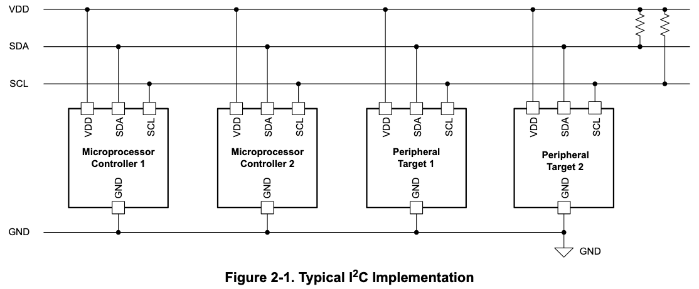
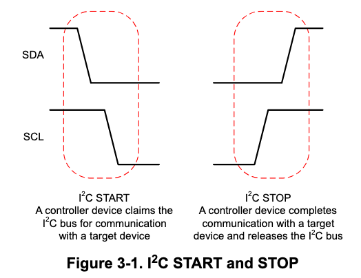
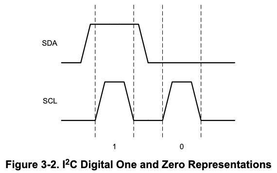
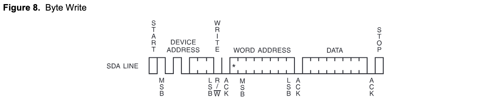
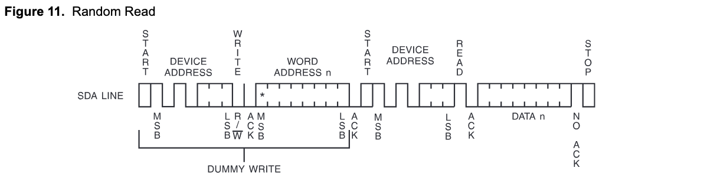

# 51单片机 I2C 通讯

## 前提条件

- 已完成[51单片机串口通讯](51-mcu-uart)

## 了解 I2C

`I2C`总线全程 Inter IC Bus, 常用于芯片间通信, 比如说从`AT24C02`存储芯片中读取数据. 会使用到两根通信线 `SCL`(Serial Clock), `SDA`(Serial Data).

### I2C 接线

- 所有`I2C`设备的`SCL`连在一起, `SDA`连在一起
- 所有`I2C`设备的`SCL`和`SDA`均要配置成开漏输出模式
- 在`SCL`和`SDA`上各添加一个上拉电阻, 阻值一般为4.7kΩ
- 开漏输出和上拉电阻主要是为了解决多机通信互相干扰的问题

> https://www.ti.com/lit/an/sbaa565/sbaa565.pdf?ts=1725775105679

### I2C 时序

- 起始条件`S`: `SCL`高电平期间, `SDA`从高电平切换为低电平.
- 终止条件`P`: `SCL`高电平期间, `SDA`从低电平切换为高电平.
   
   > https://www.ti.com/lit/an/sbaa565/sbaa565.pdf?ts=1725775105679
- 发生数据`SD`: 主设备取出待发送数据(8bit)的最高位, 将`SDA`设置为该值. 而后拉高`SCL`再拉低`SCL`, 从设备会在`SCL`的下降沿读取`SDA`的值. 所以在`SCL`线高电平期间, `SDA`的值必须保持稳定, 毕竟此时从设备正在读取数据. 重复这一过程8次, 即可发送 8bit 数据.
     
   > https://www.ti.com/lit/an/sbaa565/sbaa565.pdf?ts=1725775105679
- 接收数据`RD`: 主设备先将`SDA`设置为1以释放`SDA`. 然后主设备拉高`SCL`再拉低`SCL`创造一个时钟脉冲, 在这个脉冲期间, 从设备会把它要发出的值写在`SCL`上, 所以在这个脉冲期间主设备还需要读取`SDA`的值. 创建8个脉冲, 读取8次`SDA`, 就能拼接出一个完整的 byte(8bit)
- 接收应答`RA`: 时序图切片与数据传输相同, 可以理解为数据传输的第9位. 主设备每发送一个 byte 后, 从设备会向主设备发送一个应答位(1bit), 0 表示成功收到数据 ACK(Acknowledge), 1 表示没有收到数据或通信结束 NAK(Not Acknowledge)
- 发送应答`SA`: 时序图切片与数据传输相同, 可以理解为数据传输的第9位. 主设备每收到一个 byte 后, 需要先从设备发送一个应答位(1bit), 0 表示成功收到数据 ACK(Acknowledge), 1 表示没有收到数据或通信结束 NAK(Not Acknowledge)

注意! 上述简写字母为作者自定义, 用来代表时序图的切片, 不是标准的简写.

例子1, 发送一帧数据.
1. 起始
2. 发送数据. 内容为从设备地址, 数据大小 1byte. 其中前7位为设备地址, 最后一位为发送/接受标志位. 例如, 对于`AT24C02`芯片来说
   - 设备地址的前4位为固定值 0b1010
   - 后3位由芯片引脚 A0, A1, A2 所接的电平高低决定, 假设它们都接了 GND, 那它们就是 0b000
   - 观察数据手册发现, 时序图中 R/W 的 W 上划了一根横线, 所以代表 1 是 Read, 0 是 Write. 由于是写入, 所以值为 0b0
   - 所以第一个 byte 的具体值为 0b10100000
3. 接收应答
4. 发送数据, 接收应答 ... 发送数据, 接收应答
5. 终止
  

例子2, 接受一帧数据
1. 起始
2. 发送数据. 内容为从设备地址, 数据大小 1byte. 其中前7位为设备地址, 最后一位为发送/接受标志位. `AT24C02`芯片来说, 由于是读操作, 所以最后一位是 1, 因为观察数据手册发现, 时序图中 R/W 的 W 上划了一根横线, 这意味着代表 1 是 Read, 0 是 Write.
3. 接收应答
4. 接收数据, 发送应答 ... 接收数据, 发生应答
5. 终止

## 读写 AT24C02 芯片

### 效果展示

1. 在串口监视器中发送'r', 单片机从`AT24C02`读取数据, 打印出原始数据.
2. 在串口监视器中发送'w', 单片机向`AT24C02`写入数据.
3. 在串口监视器中发送'r', 单片机从`AT24C02`读取数据, 打印读到的数据, 该数据应与写入的数据相同.
4. 将单片机断电, 然后再上电.
5. 在串口监视器中发送'r', 单片机从`AT24C02`读取数据, 打印读到的数据, 该数据应与上一次读出的数据相同.

### 参考资料

- 数据手册 [Two-wire Serial EEPROM AT24C02A | Atmel](https://ww1.microchip.com/downloads/en/DeviceDoc/doc0180.pdf)

### 工作流程(写入)

向 AT24C02 写入. 数据手册中流程图如下
  
转译为我们自定义符号的示意图
  

### 工作流程(读取)

从 AT24C02 读取. 数据手册中流程图如下
  
转译为我们自定义符号的示意图
  

### 代码编写

::: code-group
<<< ../../codes/demo207-51-i2c/src/main.c
<<< ../../codes/demo207-51-i2c/src/at24c02.c
<<< ../../codes/demo207-51-i2c/src/i2c.c
:::

完整代码 [codes/demo207-51-i2c](https://github.com/arnosolo/learn-embedded-system)
