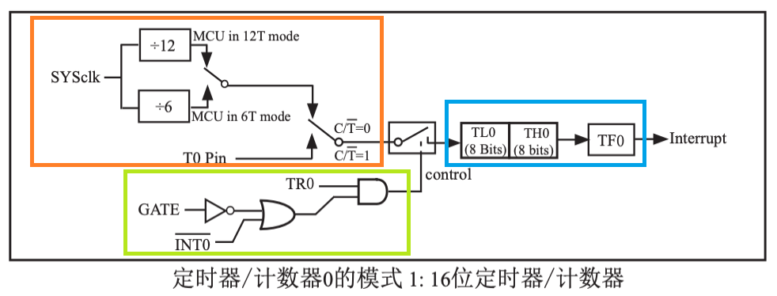

# 51单片机定时器

## 前提条件

- 已完成[搭建51单片机开发环境](setup-development-environment-for-51-mcu)

## 什么是定时器?

时钟 -> 计数单元 -> 中断系统

1. 定时器中有一个脉冲计数器, 每来一个脉冲计数加1(也可能是每多个脉冲加1, 可设置).
2. 当计数单元达到定时器中设定的阈值时, 定时器会向中断系统发出中断申请.
3. 单片机主程序暂停, 转而运行中断服务函数.

下面以 STC89C52RC 定时器0 进行进一步讲解.

打开`STC89C52RC数据表`, 7.1 定时器/计数器0/1 章节. 了解到定时器一共有三部分组成. 时钟源, 控制开关, 计数器 (非专业名词, 仅用于指代下方图片中内容).

1. 时钟源可以是内部时钟, 也可以是外部时钟. 如果是内部时钟, 那么要么是12个时钟计数器加1(12T模式), 要么就是6个时钟计数器加1(6T模式).
2. 当计数器达到最大时(模式1为 2^16 = 65536), 中断标识位`TF0`会由硬件置为1, 向CPU请求中断, 知道中断被响应后, `TF0`重新被硬件置为0
3. 控制开关设置三个寄存器, 对于定时器0, 只有TR0被程序置为1时, 定时器才开始运作.

## 每秒切换一次LED灯的状态

理解完上述原理后, 我们开始构思程序.
1. 定义一个`中断服务函数`, 每ms由定时器触发一次, 累计触发1000次后切换 LED 灯状态
2. 根据开发板原理图了解到时钟源是内部还是外部, 时钟频率是多少. 据此计算出每 1ms 定时器计数器会增加的值, 最后结合计数器的最大值, 计算出`计数器的初始值`. 比如说, 当前开发板上有一颗 11.0592MHz 的晶振, 接在了单片机的`XTAL1`和`XTAL2`引脚上作为单片机的系统时钟. 
   - 那么每秒晶振输出 11059200 个脉冲, 每秒计时器增加 (11059200 / 12) = 921600
   - 每 ms 计时器增加 (921600 / 1000) = 921.6
   - 假设定时器工作在模式1, 那么计数器的最大值为 65536, 计数器达到最大值时会触发一个中断, 那么如果每次中断发生时, 将计数器的值置为 (65536 - 922) = 64614
   - 那么 1ms 后, 计数器的值将达到65536, 中断触发.
3. 定义一段`初始化程序`, 它应当具备一下功能. 配置定时器的工作模式, 启动定时器, 启动中断服务.

示例代码 codes/demo204-51-timer
::: code-group
<<< ../../codes/demo204-51-timer/src/main.c
<<< ../../codes/demo204-51-timer/src/utils.c
:::
