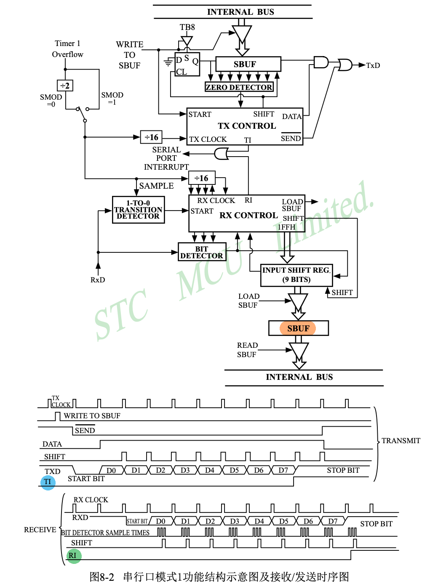

# 51单片机串口通讯

## 前提条件

- 已完成[51单片机定时器](51-mcu-timer)

## 51单片机与个人电脑进行通信

### 目标

通过`串口监视器`向`单片机`发送一个字符后, `单片机`返回相同字符.

### 原理

原理其实是挺复杂的, 不信你看时序图. 但是程序实现非常简单, 只需要操作3个寄存器就可以了.

> STC89C52RC数据手册, 8 串行口通信

发送数据:
1. 单片机发送第一个 byte 的时候, 只需要向`SBUF`寄存器写入 1byte, 数据就发出去了. 发送过程中`TI`寄存器会被硬件置为0, 发送完成后`TI`寄存器会被硬件置1.
2. 发送第2个 byte 的时候, 需要先将`TI`寄存器软件置0, 然后再向`SBUF`寄存器写入第2个 byte.

接收数据:
1. 接收数据可以在中断响应函数中完成, 毕竟电脑随时都可能会向单片机发送数据.
2. 在中断响应函数中, 如果发现`RI`寄存器等于1, 说明当前中断是接受中断, 程序可以直接从`SBUF`寄存器中读取数据. 完事了记得将`RI`寄存器置1, 好接收下一 byte 数据.

### 接线

接线`开发板原理图`中已给出, 主要就是要记得
- 单片机的`RX`要和目标设备的`TX`相连接, 单片机的`TX`要和目标设备的`RX`相连接.
- 单片机不能直接和个人电脑进行通信, 它们之间还需要连接一个`CH340G`芯片.

### 程序

示例代码 codes/demo205-51-uart

定时器初始值计算公示
- 定时器初始值 = 定时器最大值 - (系统时钟频率 / 定时器分频数) / (波特率 * (32 / 2^SMOD))
- 定时器初始值 = 256 - (11059200 / 12) / (9600 * (32 / 2^1)) = 250 = 0xFA

进一步解释
1. 那么每秒晶振输出 11059200 个脉冲, 每秒`定时器`计时器增加 (11059200 / 12) = 921_600
2. 假设波特率使用 9600. 这就意味着`TX Clock`的时钟频率为 9600. 这个时钟的来源是`定时器`溢出, `定时器`溢出1次产生1个脉冲, 而后经过16分频(`SMOD`为1)得到最终的`TX Clock`的时钟, 也就是说定时器溢出16次, `TX Clock`是出现一个脉冲. 所以`定时器`每秒需要溢出频率 9600 * 16 = 153_600 次
3. 在1秒内, `定时器`计时器增加了 921_600 次, 其中 153_600 次`定时器`出现了溢出. 那么每次`定时器`溢出计数器增加了 921_600 / 153_600 = 6. 假设`定时器`工作在模式2(8位自动重装载模式), 该模式下计数器最大值为 2^8 = 256. 得到`定时器`的起始值应该为 256 - 6 = 250 = 0xFA

::: code-group
<<< ../../codes/demo205-51-uart/src/main.c
:::

## (可选)什么是串口?

串口(Serial Port), 全称为**串行通信端口**, 是一种用于数据传输的接口. 与并口(并行端口)不同, 串口一次只传输一位(bit)数据, 但它的数据传输线较少, 通常只需要一根数据线, 因此在长距离传输上更有优势. 串口是计算机和外设之间进行通信的一种常见方式, 广泛应用于各种嵌入式系统和工业设备中. 

### 串口的特点
- **数据传输方式**：串行通信一次只传输一位数据, 数据位按顺序排队依次传输. 
- **传输速率**：用波特率(Baud Rate)表示, 常见的波特率有9600、19200、115200等. 
- **通信距离**：由于串口只使用一根数据线, 相对于并口, 在长距离传输中信号衰减小, 抗干扰能力强. 

### 常见的串口类型
1. **RS-232**：最常见的串口标准之一, 常用于计算机和调制解调器之间的通信. RS-232接口的最大传输距离为15米左右, 通常用于短距离通信.
2. **RS-485**：相比RS-232, RS-485可以支持更长距离的传输(通常可以达到1200米), 并且支持多点通信(即一个主机可以与多个设备通信), 常用于工业控制环境.
3. **UART(Universal Asynchronous Receiver/Transmitter)**：是用于串行通信的硬件模块, 广泛集成在微控制器(如51单片机)中, 用于实现串行数据的发送和接收.

### 串口的基本信号
- **TXD(Transmit Data)**：发送数据端, 负责发送数据.
- **RXD(Receive Data)**：接收数据端, 负责接收数据.
- **GND(Ground)**：地线, 提供信号的参考电平.
- **RTS(Request To Send)和CTS(Clear To Send)**：用于硬件流控制的信号线(可选).

### 应用
- **调试**：嵌入式开发中, 串口常用作调试接口, 用于输出调试信息. 
- **设备控制**：常用于计算机控制外设, 如PLC、传感器、执行器等. 
- **数据传输**：设备之间的数据传输, 如GPS模块、蓝牙模块等.
