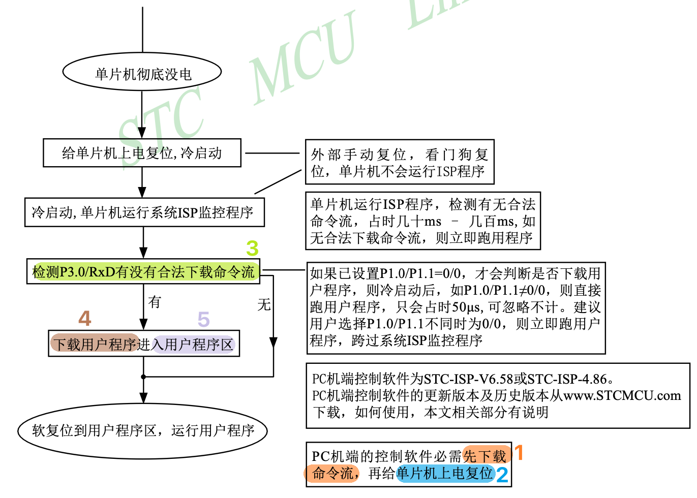

# 搭建51单片机开发环境

## 效果展示

点亮`D2`LED灯


## 前提条件

1. 已学习`微机原理`
2. 了解如何在终端中运行`指令`
3. 一块`51单片机开发板`(本文采用了普中A2开发板, MCU为STC89C52RC)
4. 下载`开发板原理图`. [普中科技-各型号产品资料下载链接](http://www.prechin.cn/gongsixinwen/208.html)
5. 下载`STC89C52RC数据手册`. [STC 技术支持 数据手册](https://www.stcmicro.com/cn/sjsc.html)

## 原理解析

1. 打开`开发板原理图`, 找到`D2`LED灯. 发现其一端连着`VCC`, 另一端连着`P2.1`引脚.
2. 打开`STC89C52RC数据手册`, 找到管脚说明章节. 发现`P2.1`引脚内部有上拉电阻, 未使用时为高电平, 故`D2`LED灯默认不亮, 需要单片机将`P2.1`引脚设置为低电平才会亮. 这一步需要修改单片机中的程序才能实现.
3. 修改单片机中的程序总共需要3步. `main.c` -编译-> `firmware.hex` -烧录-> `MCU ROM`
   - 使用c语言编写一个文本文件`main.c`
   - 使用编译器将`main.c`文件转换为一个机器码文件`firmware.hex`(当然也可以叫其它名字)
   - 使用烧录器将`firmware.hex`文件烧录到单片机ROM中

## 实现

### 安装编译器 SDCC

本文使用的编译器是[SDCC](https://sdcc.sourceforge.net/).
- Window: 打开上述网站下载并安装
- Linux: 使用包管理工具安装
- macOS: 使用 Homebrew 安装
  ```bash
  brew install sdcc
  ```

安装完成后, 查看`SDCC`版本, 如果有输出说明安装成功.
```bash
sdcc -v
```

### 编写源码

示例代码 codes/demo200-51-led

1. 打开`STC89C52RC数据手册`, 找到`P2`寄存器的地址为`0xA0`(3.3特殊功能寄存器), 寄存器默认值为`0b11111111`. 如果需要将`P2.1`引脚设置为低电平, 则需要将改寄存器的值修改为`0b10111111`
2. 打开[SDCC 用户手册](https://sdcc.sourceforge.net/doc/sdccman.pdf). 发现存在两个关键字`__sfr`和`__sbit`. 它们的作用分别为:
   - __sfr(Special Function Register)关键字用于声明 8051 微控制器中的特殊功能寄存器, 这些寄存器与微控制器的特定硬件功能（如端口、定时器、串口等）直接相关. __sfr 允许程序员通过变量名直接访问这些寄存器.
   ```c
   __sfr __at (0x80) P0;  // P0 被声明为一个特殊功能寄存器, 地址为 0x80
   P0 = 0b00001111;       // 将 P0 寄存器的值设置为 0b00001111
   ```
   - __sbit(Special Bit)关键字用于声明和访问特殊功能寄存器中的单个位, 通常用于直接控制或读取某个位的状态, 比如控制引脚的高低电平
   ```c
   __sbit __at (0x90) P0_0;  // P0_0 被声明为一个特殊位, 对应 P0 端口的第 0 位
    P1_0 = 0;                // 将 P1.0 设为低电平
   ```
3. 创建文件夹`demo200-51-led`
4. 创建文件`demo200-51-led/src/main.c`
   ```c
    __sbit __at (0xA1) P2_1 ;

    void main() {
      P2_1 = 0; // 将 P2.1 设为低电平
      while (1) {}
    }
   ```

### 编译

1. 使用编译器将`main.c`文件转换为一个机器码文件`firmware.hex`
   ```bash
   mkdir build # 如需
   sdcc -o build/firmware.hex src/main.c
   ```
2. 打开`firmware.hex`文件, 发现内容物是一堆机器码.
   ```txt
    :03000000020006F5
    ...
    :00000001FF
   ```

### 烧录

我们打开`STC89C52RC数据手册`, 10.1.1 在系统可编程（ISP）原理使用说明. 了解到给`STC89C52RC微控制器`烧录程序有 5 个步骤, 其中前两个步骤需要程序员来进行操作.

1. 程序员使用PC端烧录软件向单片机传输命令流
2. 程序员手动给单片机上电复位
3. 单片机复位后检测RxD是否有合法下载命令流
4. 单片机下载用户程序
5. 单片机进入用户程序区

了解了基本流程后, 我们开始实现这个流程.
1. 查看`开发板原理图`得知该开发板使用`CH340`芯片, 通过该芯片USB信号转换为TTL（Transistor-Transistor Logic）电平信号, 进而将程序从PC下载到单片机. 为此我们将需要安装`CH340`芯片的驱动, 使得PC能够将开发板识别为一个普普通通的USB设备. 
2. 在 Linux, macOS上你可以通过查看`/dev/`文件夹的文件列表来查看操作系统设备到的设备.
   ```bash
   ls /dev/cu* # 使用CH340芯片的USB设备一般是cu开头
   ```
3. (如需)根据你的PC的操作系统安装对于的驱动 [wch CH341 驱动下载](https://www.wch.cn/downloads/CH341SER_ZIP.html). 安装完成后再次列出设备, 看看PC是否已经设备到开发板. 我的设备路径是`/dev/cu.usbserial-140`
4. (如需)本次我们将使用[stcgal 烧录器](https://github.com/grigorig/stcgal)进行烧录. 请根据文档要求进行安装
   ```bash
   pip3 install stcgal
   stcgal -V # 验证安装, 成功会返回版本号
   ```
5. 将开发板连接到PC, 按下开发板电源开关, 使得开发板通上电.
6. 运行烧录指令, 获得提示 "Waiting for MCU, please cycle power".
   ```bash
   sdcc -o build/firmware.hex src/main.c
   ```
7. 根据提醒, 按下开发板电源开关, 开发板断电. 再次按下开发板电源开关, 开发板通电. 如果一切运行良好, 终端中会打印出一些文字, 类似"Writing flash: 640 Bytes [00:00, 7483.63 Bytes/s]". 显示出PC正在向单片机传输程序.
8. 传输完成后, 单片机会自动开始运行收到的用户程序. 也就是我此时我们应该能看到`D2`LED灯被点亮.

额外练习:
- 通过修改`P2`寄存器的值来控制LED灯的亮灭.

### (可选)安装 PlatformIO

尽管我们在命令行中手动完成整个流程, 但是使用安装`PlatformIO`可以一些额外的好处. 比如说, 自动找到开发板的设备名称.

示例代码 codes/demo201-51-platformio-led

1. 下载`VS Code`
3. 在`VS Code`中安装`PlatformIO`插件
4. 创建`PlatformIO`工程, 开发板型号选择`STC89C52RC`
6. 编写`main.c`
7. 编译工程以生成机器码文件 `.pio/build/STC89C52RC/firmware.hex`
   - 选项1: 使用`PlatformIO`插件的`Build`按钮
   - 选择2: PlatformIO CLI(需要手动安装, 然后把路径添加到环境变量中)
     ```bash
     pio run
     ```
9. 将机器码文件烧录进`MCU`中. `Platform IO`自带烧录器, 但是我实际操作没有成功过, 所以我采用的都是手动模式
   ```bash
   # 使用 pio
   pio run --target upload
   # 使用 stcgal
   stcgal -P stc89 -p /dev/cu.usbserial-140 ./.pio/build/STC89C52RC/firmware.hex
   ```
